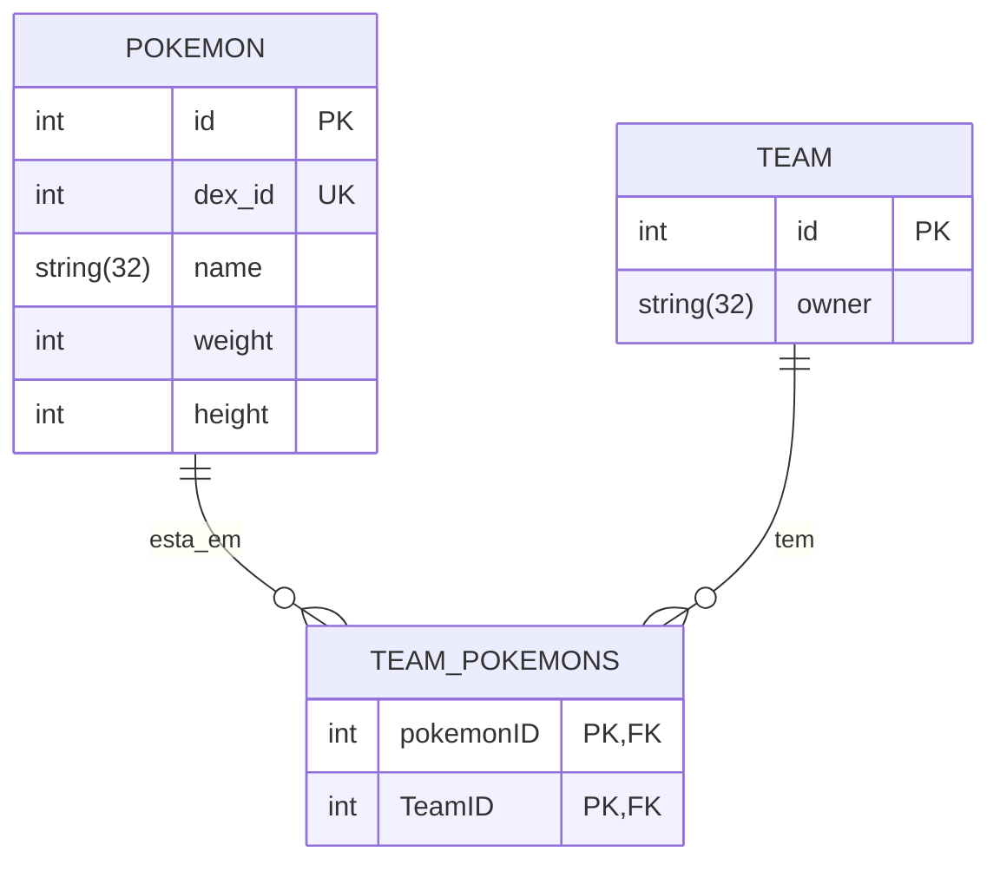

# Desafio Triagil
Repositório dedicado ao desafio técnico para admissão como estagiario backend na empresa Triagil


<h2>Executando o projeto sem docker</h2>

<p>Para rodar o projeto, siga as etapas abaixo:</p>

<ol>

<li>Crie um ambiente virtual para isolar as dependências do projeto:</li>
    <pre>python -m venv venv</pre>

<li>Ative o ambiente virtual:</li>
<ul>
    <li>No Windows:</li>
    <pre>venv\Scripts\activate</pre>
    <li>No Linux/MacOS:</li>
    <pre>source venv/bin/activate</pre>
</ul>

<li>Instale as dependências do projeto:</li>
<pre>pip install -r requirements.txt</pre>

<li>Gere sua SECRET_KEY a partir do seguinte comando no terminal:</li>
<pre>python -c 'from django.core.management.utils import get_random_secret_key; print(get_random_secret_key())'
</pre>

<li>Crie um arquivo .env na raiz do diretório do projeto, copie o conteudo de .env.example e adicione sua SECRET_KEY:</li>
<pre>SECRET_KEY='your-secret-key-here'</pre>

<li>Faça as migrações do banco de dados:</li>
<pre>python manage.py migrate</pre>


<li>Inicie o servidor de desenvolvimento:</li>
<pre>python manage.py runserver</pre>

<li>Abra o navegador e acesse o endereço http://localhost:8000 para acessar a aplicação.</li>
</ol>


<h2>Diagrama de entidade relacionamento</h2>



##  Executando o Projeto com Docker Compose
Este é um guia para executar o projeto usando o Docker Compose. O Docker Compose permite criar e executar o ambiente de desenvolvimento com todas as dependências do projeto de forma fácil e automatizada. Aqui estou usando o Postgres como banco de dados.


1 Faça clone desse repositorio:
```console
git clone https://github.com/mts-lucas/desafio-triagil.git
```
2. Criar ambiente virtual:
- Windows
```console
python -m venv venv
```
- Linux ou macOS
```console
python3 -m venv venv
```

3. Ativar ambiente virtual:
- Windows
```console
cd venv/Scripts
```
- caso use o powershell
```console
./activate
```
- caso use o cmd
```console
activate
```
- Linux ou macOS
```console
source venv/bin/activate
```

4. Instale as dependências:
```console
pip install -r requirements.txt
```
Caso tenja algum problema na instalação das dependencias, execute o comando abaixo.
```console
pip install -r requirements.txt --use-pep517
```

5. Criar arquivo .env:
Nesse caso só será necessário a SECRET_KEY. Copie e cole a variável SECRET_KEY que está em .env.example para o seu .env. Em seguida, no seu terminal execute o seguinte comando para criar:

```console
python -c "from django.core.management.utils import get_random_secret_key; print(get_random_secret_key())"
```
Irá ser gerado um uma chave onde você poderá copiar e colar  como valor da SECRET_KEY no seu .env.

6. Crie um arquivo chamado .env na raiz do projeto e cole o conteúdo do .env.example:
```console

SECRET_KEY=
POSTGRES_DB= ''
POSTGRES_USER= ''
POSTGRES_PASSWORD= ''
DB_HOST= ''
DB_PORT=

```
Certifique-se de preencher corretamente os valores para cada variável de ambiente de acordo com as configurações do seu ambiente.

7. Crie um arquivo chamado .env.docker na raiz do projeto e cole o conteúdo do .env.docker.example:
```console
DEBUG=
SECRET_KEY=
ALLOWED_HOSTS=


POSTGRES_DB=
POSTGRES_USER=
POSTGRES_PASSWORD=
DB_HOST=
DB_PORT=

PGADMIN_DEFAULT_EMAIL=
PGADMIN_DEFAULT_PASSWORD=
PGADMIN_CONFIG_SERVER_MODE=

```

  Da mesma forma, preencha as variáveis de ambiente com os valores corretos para o ambiente em que você está executando o projeto.

  Certifique-se de revisar e ajustar todas as variáveis de ambiente nos arquivos .env e .env.docker de acordo com a configuração do seu ambiente, como o nome do banco de dados, usuário, senha, host, porta, etc.

7. Execute o comando abaixo para coletar os arquivos estaticos:
```console
python manage.py collectstatic
```

8. Rodando os containers:
```console
docker compose up -d
```

9. Executando as migrations e migrates:
```console
docker container ls
docker container exec -it triagil_app python manage.py makemigrations
docker container exec -it triagil_app python manage.py migrate
```
10. Rodando os testes:
```console
docker container exec -it triagil_app python manage.py test       
```

11. Após a inicialização bem-sucedida dos contêineres, você poderá acessar o projeto em seu navegador usando o seguinte endereço:

```console

http://127.0.0.1:8000/
```

<h2>Licença</h2>

<p>Este projeto está licenciado sob a Licença MIT - consulte o arquivo LICENSE para obter mais detalhes.</p>
